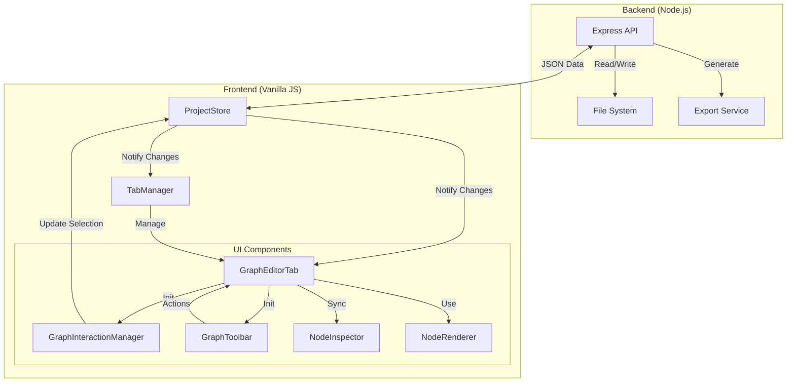

# StoryEngine v2

StoryEngine es un motor para la creación de historias interactivas no lineales y juegos conversacionales. Permite diseñar flujos narrativos complejos mediante un editor visual de grafos, gestionar personajes, variables de estado (flags) y recursos multimedia.

## Funcionamiento

El programa se divide en dos partes principales:

1.  **Servidor (Backend):** Una aplicación Node.js (Express) que gestiona la creación, guardado y carga de proyectos en el sistema de archivos local, así como la gestión de recursos (imágenes y audio) y la exportación del proyecto final.
2.  **Cliente (Frontend):** Una interfaz web construida con Vanilla JavaScript que ofrece las herramientas de edición:
    *   **Editor de Grafos:** Para conectar escenas y definir el flujo de la historia.
    *   **Gestores de Recursos:** Para personajes, flags, imágenes y audio.
    *   **Prueba en tiempo real:** Permite jugar la escena actual directamente en el editor.
    *   **Exportación:** Genera un archivo `.zip` con un reproductor HTML/JS independiente que incluye todo el contenido del proyecto listo para publicar.


## Estructura del Proyecto

```
StoryEngine/
├── server/                 # Backend Node.js/Express
│   ├── index.js            # Punto de entrada y API
│   └── package.json        # Dependencias del servidor
├── public/                 # Frontend
│   ├── css/                # Estilos
│   │   ├── main.css        # Estilos generales
│   │   └── components/     # Estilos por componente
│   ├── js/                 # Lógica de la aplicación
│   │   ├── api/            # Comunicación con el backend
│   │   ├── commands/       # Patrón comando (Undo/Redo)
│   │   ├── layout/         # Layout principal
│   │   ├── models/         # Modelos de datos (Node, Scene, etc.)
│   │   ├── state/          # Gestión de estado (ProjectStore)
│   │   ├── ui/             # Interfaz de Usuario
│   │   │   ├── core/       # Clases base (Component)
│   │   │   ├── graph/      # Componentes del editor de grafos
│   │   │   ├── tabs/       # Controladores de pestañas
│   │   │   └── ...
│   │   └── utils/          # Utilidades generales
│   └── index.html          # Punto de entrada HTML
├── projects/               # Datos de proyectos guardados (JSON)
├── tests/                  # Tests unitarios (Jest)
└── README.md               # Documentación
```

## Arquitectura

El sistema sigue una arquitectura cliente-servidor, donde el cliente mantiene el estado de la sesión de edición y el servidor actúa como proveedor de persistencia y recursos.



## Tecnologías Usadas

*   **Backend:**
    *   [Node.js](https://nodejs.org/)
    *   [Express](https://expressjs.com/): Servidor web y API REST.
    *   [Multer](https://github.com/expressjs/multer): Gestión de subida de archivos.
    *   [Archiver](https://www.npmjs.com/package/archiver): Generación de archivos ZIP para la exportación.
*   **Frontend:**
    *   HTML5 / CSS3 (Variables CSS para theming).
    *   JavaScript (ES Modules) con arquitectura basada en Componentes y Observadores.
    *   [Jest](https://jestjs.io/): Framework de testing.

## Cómo iniciar el proyecto

### Prerrequisitos
*   Tener instalado [Node.js](https://nodejs.org/).
*   Tener instalado Python (para el script de inicio del frontend).

### Pasos

1.  **Instalar dependencias del servidor:**
    Abre una terminal, navega a la carpeta `server` e instala los paquetes necesarios:
    ```bash
    cd server
    npm install
    ```

2.  **Iniciar la aplicación:**
    Desde la carpeta raíz del proyecto (`StoryEngine`), ejecuta el siguiente comando:
    ```bash
    npm start
    ```

    Este comando realizará dos acciones simultáneamente:
    *   Iniciará el servidor backend en el puerto 3000 (por defecto).
    *   Iniciará el servidor del frontend y abrirá la aplicación en tu navegador (usualmente en `http://localhost:9999`).

Una vez iniciado, podrás crear nuevos proyectos, editar los existentes y exportarlos.
